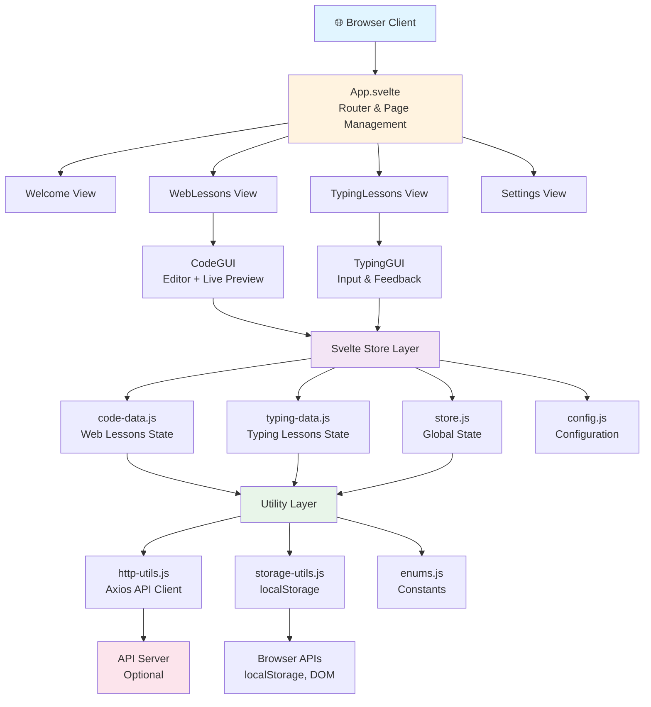
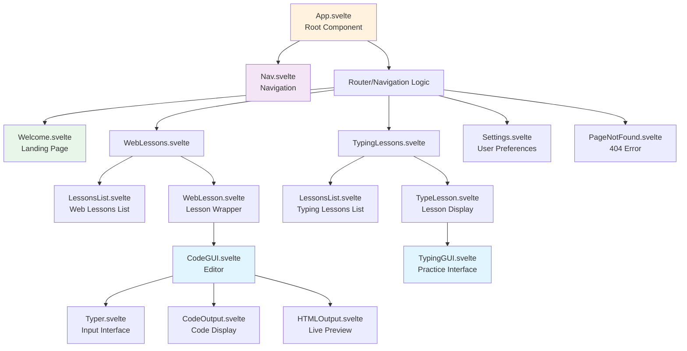
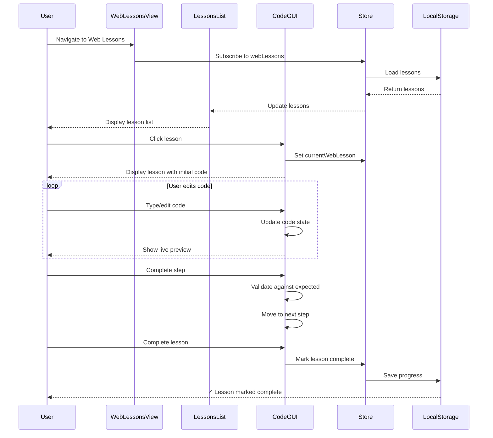
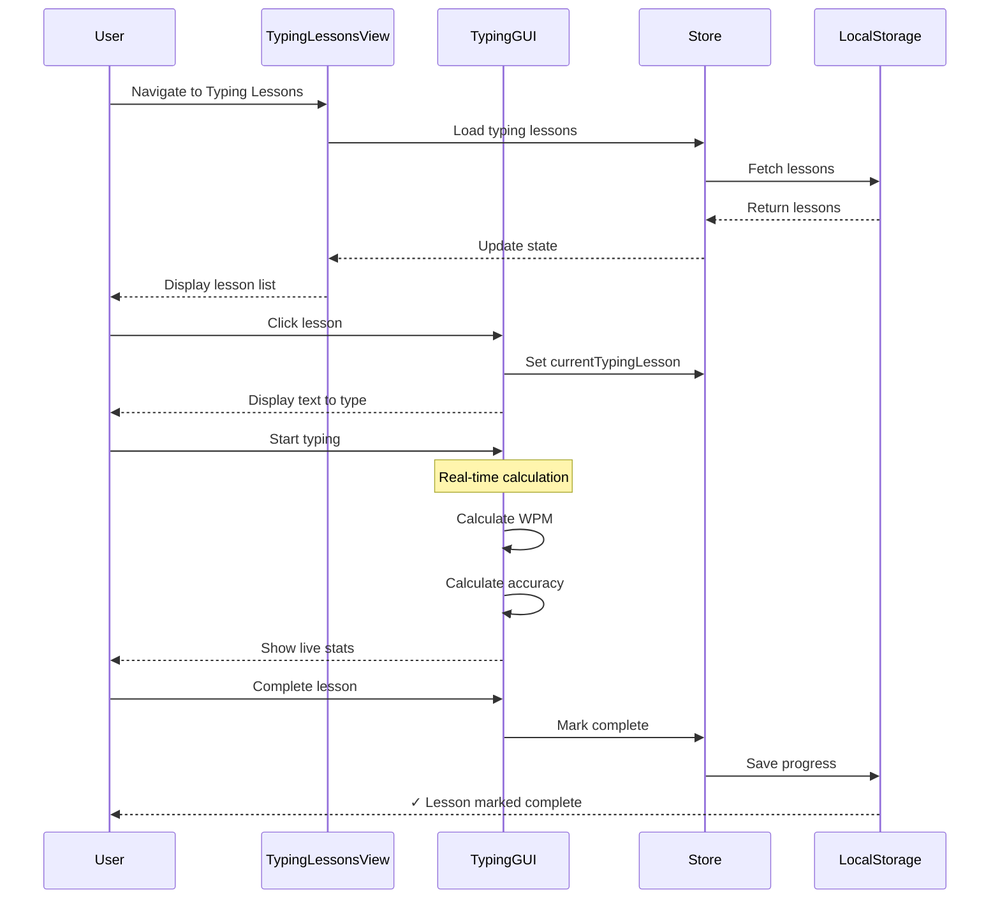

# CosmicTyper - Architecture Documentation

## System Architecture

### High-Level Overview



## Component Hierarchy

### Component Tree



### Views (Page-level)

- **Welcome.svelte** - Landing page, lesson selection
- **WebLessons.svelte** - Web lessons list and lesson selector
  - Uses: `CodeGUI`, `LessonsList`
- **TypingLessons.svelte** - Typing lessons list
  - Uses: `TypingGUI`, `LessonsList`
- **Settings.svelte** - User preferences
- **PageNotFound.svelte** - 404 error handling

### Components (Reusable)

#### CodeGUI (Web Lessons Editor)

**Functionality:**
- HTML/CSS code input with syntax highlighting
- Real-time preview of rendered HTML
- Step-by-step lesson progression
- Validation against expected output

**Sub-components:**
- **Typer.svelte** - Input/editing interface
- **CodeOutput.svelte** - Code display
- **HTMLOutput.svelte** - Live preview rendering

#### TypingGUI (Typing Practice)
- User typing interface
- Real-time WPM/accuracy calculation
- Visual feedback and progress indicators
- Lesson completion tracking

#### Shared Components
- **LessonsList.svelte** - Displays available lessons with metadata
- **TypeLesson.svelte** - Individual lesson display
- **WebLesson.svelte** - Web lesson wrapper
- **Nav.svelte** - Navigation bar
- **Redirect.svelte** - Route handling

## State Management

### Svelte Stores

The application uses Svelte's built-in store system for reactive state management:

```javascript
// store/store.js - Global state
export const appState = writable({
  currentView: 'welcome',
  userSettings: { ... }
})

// store/code-data.js - Web lessons state
export const webLessons = writable([])
export const currentWebLesson = writable(null)
export const lessonProgress = writable({ ... })

// store/typing-data.js - Typing lessons state
export const typingLessons = writable([])
export const currentTypingLesson = writable(null)
export const typingProgress = writable({ ... })
```

### Data Persistence

```javascript
// storage-utils.js
- loadLessons()     // Load from localStorage
- saveLessons()     // Save progress to localStorage
- clearLessons()    // Reset all data
```

### API Communication

```javascript
// http-utils.js
- fetchLessons()    // GET /api/lessons
- fetchLesson(id)   // GET /api/lessons/:id
- submitProgress()  // POST /api/progress
```

## Lesson Data Structures

### Web Lesson
```javascript
{
  id: string,
  title: string,
  description: string,
  difficulty: 'easy' | 'medium' | 'hard',
  hasCompleted: boolean,
  steps: WebStep[]
}

interface WebStep {
  type: 'dom' | 'style',
  desc: string,
  render: boolean,           // defaults to true
  action: string[]           // Expected code changes
}
```

### Typing Lesson
```javascript
{
  id: string,
  title: string,
  description: string,
  difficulty: 'easy' | 'medium' | 'hard',
  hasCompleted: boolean,
  steps: string[]            // Text to type
}
```

## User Flow

### Web Lessons Flow



### Typing Lessons Flow



## Dependencies & External Services

### Direct Dependencies
- **svelte** - UI framework
- **svelte-routing** - Client-side routing
- **axios** - HTTP client for API calls
- **bulma** - CSS framework
- **sass** - CSS preprocessor
- **@fortawesome/fontawesome-svg-core** - Icons
- **sirv-cli** - Development server

### External APIs (Planned)
- **Lesson API** - Currently using static lessons stored locally
  - Expected endpoint: `/api/lessons`
  - Returns: Array of lesson objects with metadata

### Browser APIs Used
- **localStorage** - Persistent user data storage
- **DOM APIs** - Dynamic content rendering
- **fetch/axios** - API communication

## File Organization

```mermaid
graph TD
    A["src/"]
    A --> B["App.svelte<br/>Root & Router"]
    A --> C["main.js<br/>Entry Point"]
    A --> D["components/<br/>Reusable Components"]
    A --> E["views/<br/>Page Components"]
    A --> F["store/<br/>State Management"]
    A --> G["types/<br/>TypeScript Definitions"]
    
    D --> D1["CodeGUI/"]
    D1 --> D1a["CodeGUI.svelte"]
    D1 --> D1b["Typer.svelte"]
    D1 --> D1c["CodeOutput.svelte"]
    D1 --> D1d["HTMLOutput.svelte"]
    
    D --> D2["TypingGUI/"]
    D2 --> D2a["TypingGUI.svelte"]
    
    D --> D3["LessonsList.svelte"]
    D --> D4["Nav.svelte"]
    D --> D5["TypeLesson.svelte"]
    D --> D6["WebLesson.svelte"]
    D --> D7["Redirect.svelte"]
    D --> D8["index.js<br/>Exports"]
    
    E --> E1["Welcome.svelte"]
    E --> E2["WebLessons.svelte"]
    E --> E3["TypingLessons.svelte"]
    E --> E4["Settings.svelte"]
    E --> E5["PageNotFound.svelte"]
    
    F --> F1["store.js<br/>Global State"]
    F --> F2["code-data.js<br/>Web Lessons"]
    F --> F3["typing-data.js<br/>Typing Lessons"]
    F --> F4["http-utils.js<br/>API Client"]
    F --> F5["storage-utils.js<br/>localStorage"]
    F --> F6["config.js<br/>Configuration"]
    F --> F7["enums.js<br/>Constants"]
    
    G --> G1["lesson.ts"]
    G --> G2["progress.ts"]
    G --> G3["api.ts"]
    G --> G4["index.ts"]
    
    style A fill:#fff3e0
    style D fill:#e8f5e9
    style E fill:#f3e5f5
    style F fill:#e1f5ff
    style G fill:#fce4ec
```



## Key Design Patterns

### 1. Store Subscriptions
Components subscribe to stores for reactive updates:
```javascript
let lessons;
onMount(() => {
  const unsubscribe = webLessons.subscribe(value => {
    lessons = value;
  });
  return unsubscribe;
});
```

### 2. Reactive Declarations
Svelte's reactivity system for derived state:
```javascript
$: progress = lessons?.filter(l => l.hasCompleted).length;
```

### 3. Event Forwarding
Components emit events that bubble up to parent handlers:
```javascript
// Child component
dispatch('lessonComplete', { lessonId });

// Parent component
on:lessonComplete={handleCompletion}
```

### 4. Conditional Rendering
Dynamic view switching based on application state:
```javascript
{#if currentView === 'welcome'}
  <Welcome />
{:else if currentView === 'webLessons'}
  <WebLessons />
{/if}
```

## Performance Considerations

### Current Issues
- No code splitting
- No lazy loading of components
- All lessons loaded upfront
- No optimization for large datasets

### Optimization Opportunities
- Implement virtual scrolling for lesson lists
- Lazy load lesson content on demand
- Code splitting by route
- Image optimization
- CSS/JS minification (handled by build tool)

## Security Considerations

### Current Approach
- Client-side only validation
- No authentication/authorization
- All data stored in localStorage (unencrypted)
- No CSRF protection (no server state)

### Future Considerations
- Input sanitization for HTML preview (potential XSS)
- User authentication for lesson tracking
- Secure API communication (HTTPS, tokens)
- Content Security Policy (CSP) headers

## Error Handling

### Current State
- Minimal error handling visible
- No error boundaries
- Silent failures possible

### Recommendations
- Add Svelte error boundaries
- User-friendly error messages
- Logging/monitoring integration
- Graceful degradation for API failures
