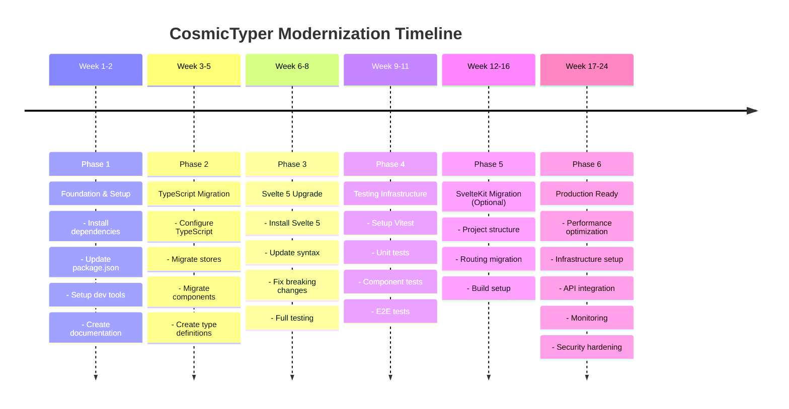

# CosmicTyper - Modernization Roadmap

**Status:** Planning Phase  
**Target:** Bring CosmicTyper to modern web development standards  
**Timeline:** 3-6 months (flexible based on priority)

## Vision

Transform CosmicTyper from a 2020-era Svelte project into a modern, maintainable, type-safe educational platform with:
- Latest framework versions
- Comprehensive test coverage
- Improved developer experience
- Enhanced performance
- Production-ready infrastructure

## Phases Overview



| Phase | Focus | Timeline | Priority |
|-------|-------|----------|----------|
| 1 | Foundation & Setup | Week 1-2 | 🔴 Critical |
| 2 | TypeScript Migration | Week 3-5 | 🔴 Critical |
| 3 | Svelte Framework Upgrade | Week 6-8 | 🟡 High |
| 4 | Testing Infrastructure | Week 9-11 | 🟡 High |
| 5 | SvelteKit Migration (Optional) | Week 12-16 | 🟢 Medium |
| 6 | Production Ready | Week 17-24 | 🟢 Medium |

---

## Phase 1: Foundation & Setup (Week 1-2)

### Goals
- Get project building and running
- Establish development environment
- Document current state
- Create modernization guidelines

### Tasks

#### 1.1 Install Dependencies
```bash
npm install
npm audit fix --force  # Address security vulnerabilities
```

**Deliverables:**
- ✅ All dependencies installed
- ✅ Security audit report
- ✅ Build system operational

#### 1.2 Update package.json Metadata
```json
{
  "name": "cosmic-typer",
  "version": "2.0.0",
  "description": "Educational typing practice and web development learning platform",
  "author": "Jeremy Lawson",
  "license": "MIT"
}
```

**Deliverables:**
- ✅ Corrected package metadata
- ✅ Consistent naming throughout

#### 1.3 Setup Development Tools
- ESLint configuration (modern standards)
- Prettier for code formatting
- Git hooks (pre-commit linting)
- Environment configuration (.env.example)

**Deliverables:**
- ✅ .eslintrc updated
- ✅ .prettierrc configured
- ✅ husky hooks installed
- ✅ .env.example created

#### 1.4 Documentation & Guidelines
- ✅ PROJECT_ANALYSIS.md (✓ Done)
- ✅ ARCHITECTURE.md (✓ Done)
- ✅ Create CONTRIBUTING.md (development guidelines)
- ✅ Create DEVELOPMENT.md (setup & running locally)
- ✅ Create DEPLOYMENT.md (how to deploy)

### Success Criteria
- [ ] Project builds without errors
- [ ] Development server runs on port 7777
- [ ] All dependencies are audited and secure
- [ ] Documentation is comprehensive and current
- [ ] Linting passes with no warnings

---

## Phase 2: TypeScript Migration (Week 3-5)

### Goals
- Add type safety across codebase
- Improve IDE support and developer experience
- Catch errors at compile time
- Improve code documentation

### Dependencies
- `typescript` - TypeScript compiler
- `svelte-check` - Svelte type checking
- `@types/*` - Type definitions

### Tasks

#### 2.1 TypeScript Configuration
```bash
# Install TypeScript
npm install -D typescript svelte-check tslib

# Create tsconfig.json
npx tsc --init
```

**Deliverables:**
- ✅ tsconfig.json with Svelte settings
- ✅ svelte.config.js updated for TypeScript

#### 2.2 Migrate Store System
Priority: **HIGH** (most used)

**Files:**
- `src/store/store.js` → `src/store/store.ts`
- `src/store/code-data.js` → `src/store/code-data.ts`
- `src/store/typing-data.js` → `src/store/typing-data.ts`
- `src/store/http-utils.js` → `src/store/http-utils.ts`

**Steps:**
1. Convert to TypeScript with types
2. Create interfaces for data structures
3. Type all function parameters and returns
4. Add JSDoc comments

**Example:**
```typescript
// src/store/store.ts
import { writable, Writable } from 'svelte/store';

interface AppState {
  currentView: 'welcome' | 'webLessons' | 'typingLessons' | 'settings';
  userSettings: UserSettings;
}

interface UserSettings {
  theme: 'light' | 'dark';
  soundEnabled: boolean;
}

export const appState: Writable<AppState> = writable({
  currentView: 'welcome',
  userSettings: { theme: 'light', soundEnabled: true }
});
```

#### 2.3 Migrate Components
Priority: **HIGH**

**Approach:**
- Start with leaf components (no children dependencies)
- Move upward through component tree
- Add lang="ts" to script tags
- Type props and events

**Files to migrate:**
1. Components without dependencies
   - `Nav.svelte`
   - `Redirect.svelte`
2. Components with dependencies
   - `CodeGUI/*`
   - `TypingGUI/*`
   - Page components

**Example:**
```svelte
<script lang="ts">
  import type { SvelteComponentTyped } from 'svelte';
  
  interface Lesson {
    id: string;
    title: string;
    difficulty: 'easy' | 'medium' | 'hard';
  }
  
  export let lesson: Lesson;
  export let onComplete: (lessonId: string) => void;
</script>
```

#### 2.4 Type Definitions
Create `src/types/` directory:
```
src/types/
├── lesson.ts        # Lesson interfaces
├── progress.ts      # Progress tracking types
├── api.ts          # API response types
└── index.ts        # Export all types
```

**Example:**
```typescript
// src/types/lesson.ts
export type Difficulty = 'easy' | 'medium' | 'hard';

export interface WebLesson {
  id: string;
  title: string;
  description: string;
  difficulty: Difficulty;
  hasCompleted: boolean;
  steps: WebStep[];
}

export interface WebStep {
  type: 'dom' | 'style';
  desc: string;
  render: boolean;
  action: string[];
}

export interface TypingLesson {
  id: string;
  title: string;
  description: string;
  difficulty: Difficulty;
  hasCompleted: boolean;
  steps: string[];
}
```

#### 2.5 API Types
```typescript
// src/types/api.ts
export interface ApiResponse<T> {
  data: T;
  status: number;
  message?: string;
}

export interface LessonResponse {
  webLessons: WebLesson[];
  typingLessons: TypingLesson[];
}
```

#### 2.6 Update Build Configuration
- Update rollup.config.js for TypeScript
- Add TypeScript plugin if needed
- Update build script: `npm run build`

### Success Criteria
- [ ] All .js files converted to .ts
- [ ] svelte-check passes with no errors
- [ ] TypeScript compilation succeeds
- [ ] No `any` types without justification
- [ ] Type coverage > 90%
- [ ] Existing functionality preserved

---

## Phase 3: Svelte Framework Upgrade (Week 6-8)

### Goals
- Update from Svelte 3.31.2 → Svelte 5.x
- Modernize component syntax
- Leverage new language features
- Maintain feature parity

### Dependencies to Update
```json
{
  "svelte": "^5.x.x",
  "svelte-check": "^3.x.x"
}
```

### Breaking Changes to Address

#### 3.1 Component Import Changes
Svelte 5 changes how components and event handlers work

**Before (Svelte 3):**
```svelte
<script>
  import { onMount } from 'svelte';
  let count = 0;
</script>

<button on:click={() => count++}>
  {count}
</button>
```

**After (Svelte 5):**
```svelte
<script>
  let count = $state(0);
</script>

<button onclick={() => count++}>
  {count}
</button>
```

#### 3.2 Reactive Declaration Updates
```svelte
<!-- Svelte 3 -->
{#each items as item (item.id)}
  <Item {item} />
{/each}

<!-- Svelte 5 -->
{#each items as { id, ...item } (id)}
  <Item {...item} />
{/each}
```

#### 3.3 Store Subscriptions
```typescript
// Svelte 3 - manual subscription
let value;
const unsubscribe = store.subscribe(v => value = v);

// Svelte 5 - auto-subscription
let value = $store;
```

### Tasks

#### 3.1 Install New Svelte Version
```bash
npm install svelte@^5
npm install -D @sveltejs/vite-plugin-svelte@^3
```

#### 3.2 Update Component Syntax
Priority order:
1. Store usage (use `$store` syntax)
2. Event handlers (`on:click` → `onclick`)
3. Reactive declarations (if using old syntax)
4. Lifecycle hooks (update as needed)

#### 3.3 Update Dependencies
Other packages with breaking changes:
- @fortawesome/* - Update to v6
- bulma - Update to latest
- svelte-routing - Check compatibility or plan replacement

#### 3.4 Testing
- Run `npm run dev` and test all features manually
- Check routing works correctly
- Test code/typing lessons functionality
- Verify localStorage integration

### Success Criteria
- [ ] No console errors or warnings
- [ ] All routes functional
- [ ] Web lessons work correctly
- [ ] Typing lessons work correctly
- [ ] Performance maintained or improved
- [ ] No accessibility regressions

---

## Phase 4: Testing Infrastructure (Week 9-11)

### Goals
- Establish testing culture
- Improve code reliability
- Enable confident refactoring
- Document component behavior

### New Dependencies
```json
{
  "devDependencies": {
    "vitest": "^1.x",
    "@testing-library/svelte": "^4.x",
    "@testing-library/user-event": "^14.x",
    "jsdom": "^24.x",
    "playwright": "^1.x",
    "@playwright/test": "^1.x"
  }
}
```

### Tasks

#### 4.1 Unit Testing Setup
```bash
npm install -D vitest @testing-library/svelte jsdom
```

**vitest.config.ts:**
```typescript
import { defineConfig } from 'vitest/config';
import { svelte } from '@sveltejs/vite-plugin-svelte';

export default defineConfig({
  plugins: [svelte({ hot: !process.env.VITEST })],
  test: {
    globals: true,
    environment: 'jsdom'
  }
});
```

#### 4.2 Store Tests
Create `src/store/__tests__/`:
- `store.test.ts` - App state management
- `code-data.test.ts` - Web lessons logic
- `typing-data.test.ts` - Typing lessons logic
- `http-utils.test.ts` - API communication

**Example:**
```typescript
// src/store/__tests__/store.test.ts
import { describe, it, expect } from 'vitest';
import { appState } from '../store';

describe('appState', () => {
  it('initializes with welcome view', () => {
    let state;
    const unsubscribe = appState.subscribe(s => state = s);
    expect(state.currentView).toBe('welcome');
    unsubscribe();
  });
});
```

#### 4.3 Component Tests
Create `src/components/__tests__/`:
- Test user interactions
- Test data binding
- Test event emissions
- Test accessibility

**Example:**
```typescript
// src/components/__tests__/CodeGUI.test.ts
import { render, screen } from '@testing-library/svelte';
import CodeGUI from '../CodeGUI/CodeGUI.svelte';

describe('CodeGUI', () => {
  it('renders lesson title', () => {
    render(CodeGUI, {
      props: { lesson: { title: 'HTML Basics' } }
    });
    expect(screen.getByText('HTML Basics')).toBeInTheDocument();
  });
});
```

#### 4.4 E2E Testing Setup
```bash
npm install -D @playwright/test playwright
```

**playwright.config.ts:**
```typescript
import { defineConfig, devices } from '@playwright/test';

export default defineConfig({
  testDir: './tests/e2e',
  use: {
    baseURL: 'http://localhost:7777'
  },
  webServer: {
    command: 'npm run dev',
    port: 7777
  }
});
```

**Tests:**
- User can complete web lesson
- User can complete typing lesson
- Progress persists in localStorage
- Navigation works correctly

#### 4.5 Coverage Goals
```json
{
  "test": "vitest",
  "test:ui": "vitest --ui",
  "test:coverage": "vitest --coverage"
}
```

Target coverage:
- Statements: > 80%
- Branches: > 75%
- Functions: > 80%
- Lines: > 80%

### Success Criteria
- [ ] Unit tests for all stores
- [ ] Component tests for major components
- [ ] E2E tests for critical user flows
- [ ] Test coverage > 80%
- [ ] Tests run in CI/CD pipeline
- [ ] Documentation for testing approach

---

## Phase 5: SvelteKit Migration (Optional) (Week 12-16)

### Goals
- Modernize build system
- Add server-side rendering capability
- Improve routing
- Better file-based structure

### Decision Point
**Should we migrate to SvelteKit?**

Pros:
- Modern build tooling (Vite)
- Better routing system
- File-based routing (simpler)
- SSR capability for SEO
- Better developer experience

Cons:
- Breaking changes in structure
- Current svelte-routing investment wasted
- Larger migration effort
- May be overkill for current needs

**Recommendation:** Evaluate after Phase 4 based on project growth.

### If Proceeding

#### 5.1 Project Structure Change
```
SvelteKit structure:
src/
├── routes/           # File-based routing
│   ├── +page.svelte
│   ├── lessons/
│   │   └── web/
│   │       └── +page.svelte
│   └── lessons/
│       └── typing/
│           └── +page.svelte
├── lib/             # Shared code
│   ├── components/
│   └── stores/
└── app.svelte       # Root layout
```

#### 5.2 Routing Migration
- Remove svelte-routing dependency
- Implement SvelteKit page routing
- Update navigation components
- Update links syntax

#### 5.3 Server-side Code
- Optional: Implement backend API routes
- Session management
- API proxy endpoints

### Success Criteria
- [ ] All routes functional in SvelteKit
- [ ] Build times improved
- [ ] No functionality lost
- [ ] Tests still passing

---

## Phase 6: Production Ready (Week 17-24)

### Goals
- Deployment-ready codebase
- Performance optimized
- Monitoring & logging
- Documentation complete

### Tasks

#### 6.1 Performance Optimization
- [ ] Code splitting by route
- [ ] Image optimization
- [ ] Bundle size analysis
- [ ] Lazy loading for lesson content
- [ ] Caching strategy

#### 6.2 Infrastructure Setup
- [ ] Docker containerization
- [ ] CI/CD pipeline (GitHub Actions)
- [ ] Automated testing on push
- [ ] Staging environment
- [ ] Production deployment

**Dockerfile example:**
```dockerfile
FROM node:18-alpine
WORKDIR /app
COPY package*.json ./
RUN npm ci --only=production
COPY . .
RUN npm run build
EXPOSE 3000
CMD ["npm", "start"]
```

#### 6.3 API Integration
- [ ] Real backend API integration
- [ ] Authentication system
- [ ] Persistent lesson storage
- [ ] User progress tracking
- [ ] Analytics

#### 6.4 Monitoring & Logging
- [ ] Error tracking (Sentry)
- [ ] Performance monitoring
- [ ] User analytics
- [ ] Access logs

#### 6.5 Security Hardening
- [ ] Content Security Policy
- [ ] HTTPS enforcement
- [ ] Input sanitization (XSS prevention)
- [ ] CORS configuration
- [ ] Security headers

#### 6.6 Documentation Completion
- [ ] API documentation
- [ ] Deployment guide
- [ ] Configuration guide
- [ ] Troubleshooting guide
- [ ] Contributing guidelines

### Success Criteria
- [ ] Application deployable to production
- [ ] Zero known security vulnerabilities
- [ ] Performance metrics meet targets
- [ ] 99.5% uptime SLA
- [ ] Comprehensive documentation
- [ ] Monitoring & alerting active

---

## Post-Modernization: Future Enhancements

### Feature Ideas
1. **User System**
   - Registration and authentication
   - User profiles and progress tracking
   - Achievement badges and milestones

2. **Advanced Lessons**
   - JavaScript typing practice
   - React component practice
   - Interactive challenges

3. **Gamification**
   - Leaderboards
   - Multiplayer typing races
   - Daily challenges

4. **Accessibility**
   - Screen reader support
   - Keyboard-only navigation
   - High contrast mode

5. **Analytics**
   - Progress visualization
   - Heatmaps of common mistakes
   - Learning recommendations

### Technology Upgrades
- Machine learning for personalized lessons
- Real-time collaboration features
- Mobile app (React Native)
- Browser extension for in-situ practice

---

## Execution Notes

### Branch Strategy
```
main (stable, deployed)
├── feature/phase-1-setup
├── feature/phase-2-typescript
├── feature/phase-3-svelte-upgrade
├── feature/phase-4-testing
├── feature/phase-5-sveltekit (optional)
└── feature/phase-6-production
```

### PR Requirements
- All tests pass
- Code review approval
- No TypeScript errors
- No accessibility regressions
- Documentation updated

### Communication
- Weekly progress updates
- Blockers flagged immediately
- Community involved in major decisions
- Changelog maintained throughout

### Rollback Plan
- Keep main branch stable
- Feature branches until full phase complete
- Tag releases at phase milestones
- Revert ability maintained throughout

---

## Success Metrics

### Code Quality
- TypeScript adoption: 100%
- Test coverage: > 80%
- Zero critical security vulnerabilities
- Zero console errors in production

### Performance
- First contentful paint: < 1.5s
- Largest contentful paint: < 3s
- Cumulative layout shift: < 0.1
- Time to interactive: < 3.5s

### Developer Experience
- Setup time: < 5 minutes
- Build time: < 30 seconds
- Hot reload: < 500ms
- Documentation quality: A+

### User Experience
- No regressions in functionality
- Performance improvements > 20%
- Accessibility score: > 95
- Error rate: < 0.1%

---

## Timeline Summary

```mermaid
gantt
    title CosmicTyper Modernization Schedule
    dateFormat YYYY-MM-DD
    
    Phase 1: Foundation Setup : phase1, 2026-06-09, 14d
    Phase 2: TypeScript : phase2, after phase1, 21d
    Phase 3: Svelte 5 Upgrade : phase3, after phase2, 21d
    Phase 4: Testing : phase4, after phase3, 21d
    Phase 5: SvelteKit (Optional) : crit, phase5, after phase4, 35d
    Phase 6: Production Ready : phase6, after phase5, 56d
```

| Phase | Duration | Status | Target |
|-------|----------|--------|--------|
| Phase 1 | 2 weeks | Ready to start | 2026-06-23 |
| Phase 2 | 3 weeks | Pending Phase 1 | 2026-07-14 |
| Phase 3 | 3 weeks | Pending Phase 2 | 2026-08-04 |
| Phase 4 | 3 weeks | Pending Phase 3 | 2026-08-25 |
| Phase 5 | 4-5 weeks | Optional | 2026-09-29 |
| Phase 6 | 8 weeks | Pending Phase 5 | 2026-11-24 |

**Total estimate:** 23-24 weeks for full modernization

---

## Related Documentation
- [PROJECT_ANALYSIS.md](./PROJECT_ANALYSIS.md) - Current state assessment
- [ARCHITECTURE.md](./ARCHITECTURE.md) - System design
- [DEVELOPMENT.md](./DEVELOPMENT.md) - Setup & local development
- [DEPLOYMENT.md](./DEPLOYMENT.md) - Deployment procedures
