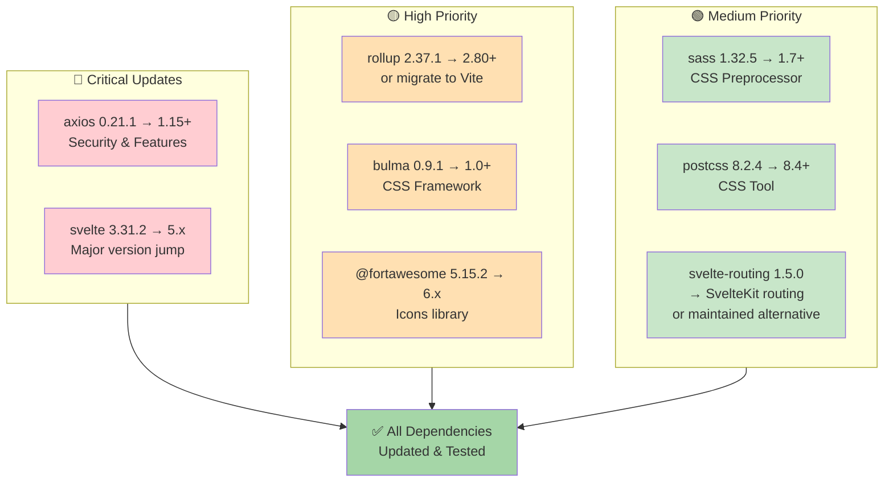
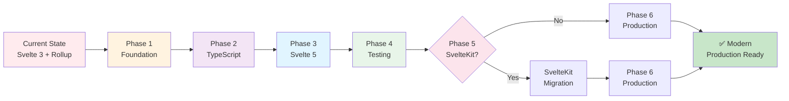

# CosmicTyper - Project Analysis

**Last Updated:** June 9, 2026  
**Current Branch:** feature/modernization  
**Status:** Legacy codebase, ready for modernization

## Executive Summary

CosmicTyper is an educational web application built with Svelte that helps students practice typing and learn web development fundamentals (HTML/CSS). The codebase is ~4-5 years old and uses significantly outdated dependencies. This document assesses the current state and identifies key areas for modernization.

## Project Purpose

CosmicTyper provides two main learning modes:

1. **Web Lessons** - Interactive practice for HTML/CSS typing
   - Users type HTML and CSS code in a live editor
   - Real-time preview of rendered output
   - Structured lessons with difficulty levels
   - Progress tracking via local storage

2. **Typing Lessons** - General typing practice
   - Speed and accuracy training
   - Lesson-based progression
   - API-driven content (currently using local fallback)

## Current State Assessment

### ✅ Strengths

- **Clear architectural separation** - Components, stores, and views are well-organized
- **Educational focus** - Well-suited for its purpose
- **Reactive framework** - Svelte's reactivity is appropriate for the interactive nature
- **Local persistence** - Smart use of localStorage for offline capability
- **Responsive routing** - Multi-page application with proper navigation

### ⚠️ Pain Points

- **Severely outdated dependencies** - Most packages are 4-5 years old
- **Legacy Svelte version** - Using Svelte 3.31.2 (current is 5.x)
- **Old build tooling** - Rollup 2.x without modern features
- **No TypeScript** - Type safety would improve maintainability
- **Missing testing** - No test coverage visible
- **Generic package name** - "svelte-app" instead of "cosmic-typer"
- **No API integration** - Using local lessons only (temporary solution noted in README)
- **No Docker/containerization** - Though a branch exists for this work

## Dependency Analysis



| Package | Current | Status | Notes |
|---------|---------|--------|-------|
| svelte | 3.31.2 | 🔴 Critical | Should upgrade to 5.x |
| axios | 0.21.1 | 🔴 Critical | Security updates needed |
| rollup | 2.37.1 | 🟡 High | Consider SvelteKit migration |
| @fortawesome/* | 5.15.2 | 🟡 High | Update to v6+ |
| bulma | 0.9.1 | 🟡 High | Current is 1.0+ |
| svelte-routing | 1.5.0 | 🟡 High | Consider SvelteKit routing |
| sass | 1.32.5 | 🟢 Medium | Significant updates available |
| postcss | 8.2.4 | 🟢 Medium | Current is 8.4+ |

**Critical Issues:**
- Dependencies are not currently installed
- No package-lock consistency checks
- Build toolchain needs modernization

## Architecture Overview

```
src/
├── components/
│   ├── CodeGUI/          (HTML/CSS editor with live preview)
│   ├── TypingGUI/        (Typing practice interface)
│   └── [shared components]
├── store/
│   ├── code-data.js      (Web lessons state)
│   ├── typing-data.js    (Typing lessons state)
│   ├── storage-utils.js  (localStorage abstraction)
│   ├── http-utils.js     (API communication)
│   └── [config, enums]
├── views/
│   ├── Welcome.svelte
│   ├── WebLessons.svelte
│   ├── TypingLessons.svelte
│   ├── Settings.svelte
│   └── PageNotFound.svelte
├── App.svelte            (Root component)
└── main.js               (Entry point)
```

## Key Findings

### Positive Aspects
1. **Modular design** - Separation of concerns is clear
2. **Store-based state** - Centralized data management
3. **Progressive disclosure** - Good UX structure for learning
4. **Persistent storage** - Smart offline-first approach

### Modernization Opportunities
1. **TypeScript** - Add type safety across codebase
2. **SvelteKit** - More modern framework with better DX
3. **Component library** - Consider Skeleton or Shadcn/svelte
4. **Testing framework** - Add Vitest + Playwright
5. **API integration** - Proper backend with real lesson management
6. **Build optimization** - Modern build tools and bundling
7. **DevOps** - Docker containerization and CI/CD

### Risk Areas
1. **Breaking changes** - Svelte 3→5 migration requires careful testing
2. **Routing migration** - svelte-routing → SvelteKit routing
3. **Build configuration** - Rollup → Vite/SvelteKit
4. **Dependency compatibility** - Cascading updates needed

## Next Steps

This analysis provides the foundation for a phased modernization approach:



1. **Phase 1** - Dependency audit and security updates
2. **Phase 2** - TypeScript migration
3. **Phase 3** - Framework upgrade (Svelte 3 → 5)
4. **Phase 4** - Testing infrastructure
5. **Phase 5** - Optional SvelteKit migration
6. **Phase 6** - API integration and production readiness

See [MODERNIZATION_ROADMAP.md](./MODERNIZATION_ROADMAP.md) for detailed plans.
