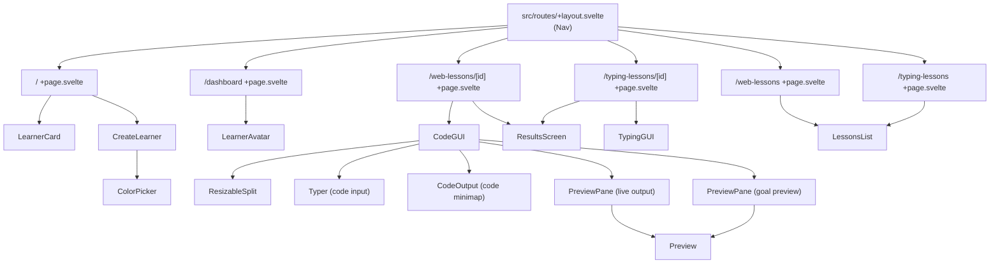

[Docs](../index.md) > [Architecture](index.md)

# Component Structure

Components live in `src/lib/components/`. They are split into feature-area subfolders for the lesson editors and kept flat for shared UI pieces.

---

## Hierarchy

---

## Component Directory

| Component | Path | Purpose |
|-----------|------|---------|
| `Nav` | `components/Nav.svelte` | Top navigation bar |
| `LearnerCard` | `components/LearnerCard.svelte` | Clickable learner profile tile |
| `LearnerAvatar` | `components/LearnerAvatar.svelte` | Colored avatar circle with initials |
| `CreateLearner` | `components/CreateLearner.svelte` | Name + color picker form |
| `ColorPicker` | `components/ColorPicker.svelte` | Fixed 8-color palette selector |
| `LessonsList` | `components/LessonsList.svelte` | Filterable lesson browser |
| `ResultsScreen` | `components/ResultsScreen.svelte` | Post-lesson stats display |
| `CodeGUI` | `components/CodeGUI/CodeGUI.svelte` | Full web lesson editor + preview |
| `Typer` | `components/CodeGUI/Typer.svelte` | Keystroke-by-keystroke input for code |
| `CodeOutput` | `components/CodeGUI/CodeOutput.svelte` | Tabbed HTML/CSS code minimap; flashes lines that just rendered |
| `PreviewPane` | `components/CodeGUI/PreviewPane.svelte` | Collapsible pane wrapper with header and pulse animation |
| `Preview` | `components/CodeGUI/Preview.svelte` | Sandboxed `<iframe>` that renders the HTML/CSS output |
| `HTMLOutput` | `components/CodeGUI/HTMLOutput.svelte` | Live HTML preview pane |
| `ResizableSplit` | `components/CodeGUI/ResizableSplit.svelte` | Draggable two-pane layout |
| `TypingGUI` | `components/TypingGUI/TypingGUI.svelte` | Full typing lesson input + feedback |

---

## Design Conventions

- Components receive data via `$props()` — no implicit store access in leaf components where avoidable.
- Events bubble up via callback props (`onselect`, `oncreate`, `oncomplete`).
- Styles are scoped per component. Global tokens live in `src/app.css` as CSS custom properties.

---

## Further Reading

- [Routing](routing.md) — which route uses which components
- [State Management](state-management.md) — how stores feed data into components
- [Web Lessons](../behaviors/web-lessons.md) — what `CodeGUI` and its sub-components do at the product level
- [Typing Lessons](../behaviors/typing-lessons.md) — what `TypingGUI` does at the product level
