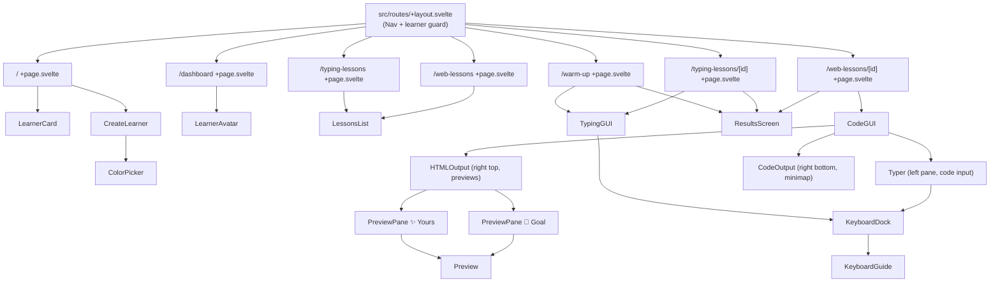

[Docs](../index.md) > [Architecture](index.md)

# Component Structure

Components live in `src/lib/components/`. They are split into feature-area subfolders for the lesson editors and kept flat for shared UI pieces.

---

## Hierarchy

`CodeGUI` arranges its three panes with nested `ResizableSplit` components: a vertical divider between `Typer` and the right column, then a horizontal divider between the previews and the minimap. `HTMLOutput` adds one more split between the Goal and Yours previews.

The `/admin` routes render their own components (`WebStepEditor`, `TypingLinesEditor`) outside the main nav — see [Lesson Authoring](../behaviors/lesson-authoring.md).

---

## Component Directory

| Component        | Path                                       | Purpose                                                        |
| ---------------- | ------------------------------------------ | -------------------------------------------------------------- |
| `Nav`            | `components/Nav.svelte`                    | Top navigation bar                                             |
| `LearnerCard`    | `components/LearnerCard.svelte`            | Clickable learner profile tile                                 |
| `LearnerAvatar`  | `components/LearnerAvatar.svelte`          | Colored avatar circle with initials                            |
| `CreateLearner`  | `components/CreateLearner.svelte`          | Name + color picker form                                       |
| `ColorPicker`    | `components/ColorPicker.svelte`            | Fixed 8-color palette selector                                 |
| `LessonsList`    | `components/LessonsList.svelte`            | Filterable lesson browser                                      |
| `ResultsScreen`  | `components/ResultsScreen.svelte`          | Post-lesson stats display                                      |
| `CodeGUI`        | `components/CodeGUI/CodeGUI.svelte`        | Full web lesson screen — typer, previews, minimap              |
| `Typer`          | `components/CodeGUI/Typer.svelte`          | Keystroke-by-keystroke input for code                          |
| `CodeOutput`     | `components/CodeGUI/CodeOutput.svelte`     | Tabbed HTML/CSS code minimap; flashes lines that just rendered |
| `HTMLOutput`     | `components/CodeGUI/HTMLOutput.svelte`     | Hosts the 🎯 Goal and ✨ Yours preview pair; pulses Yours on new output |
| `PreviewPane`    | `components/CodeGUI/PreviewPane.svelte`    | Collapsible pane wrapper with header; collapses to a thin strip |
| `Preview`        | `components/CodeGUI/Preview.svelte`        | Sandboxed `<iframe>` that renders the HTML/CSS output          |
| `ResizableSplit` | `components/CodeGUI/ResizableSplit.svelte` | Draggable two-pane layout                                      |
| `TypingGUI`      | `components/TypingGUI/TypingGUI.svelte`    | Full typing lesson input + feedback (teleprompter)             |
| `KeyboardDock`   | `components/KeyboardGuide/KeyboardDock.svelte` | Fixed bottom overlay + toggle button; show/hide persisted per learner via `prefsStore` |
| `KeyboardGuide`  | `components/KeyboardGuide/KeyboardGuide.svelte` | On-screen keyboard — next-key glow, finger tints, Shift pairing (data in `layout.ts`, `charMap.ts`) |
| `WebStepEditor`  | `components/admin/WebStepEditor.svelte`    | Admin editor for one web lesson step                           |
| `TypingLinesEditor` | `components/admin/TypingLinesEditor.svelte` | Admin editor for typing lesson lines                       |

---

## Design Conventions

- Components receive data via `$props()` — no implicit store access in leaf components where avoidable.
- Events bubble up via callback props (`onselect`, `oncreate`, `oncomplete`).
- Styles are scoped per component. Global tokens live in `src/app.css` as CSS custom properties.

---

## Further Reading

- [Routing](routing.md) — which route uses which components
- [State Management](state-management.md) — how stores feed data into components
- [Web Lessons](../behaviors/web-lessons.md) — what `CodeGUI` and its sub-components do at the product level
- [Typing Lessons](../behaviors/typing-lessons.md) — what `TypingGUI` does at the product level
