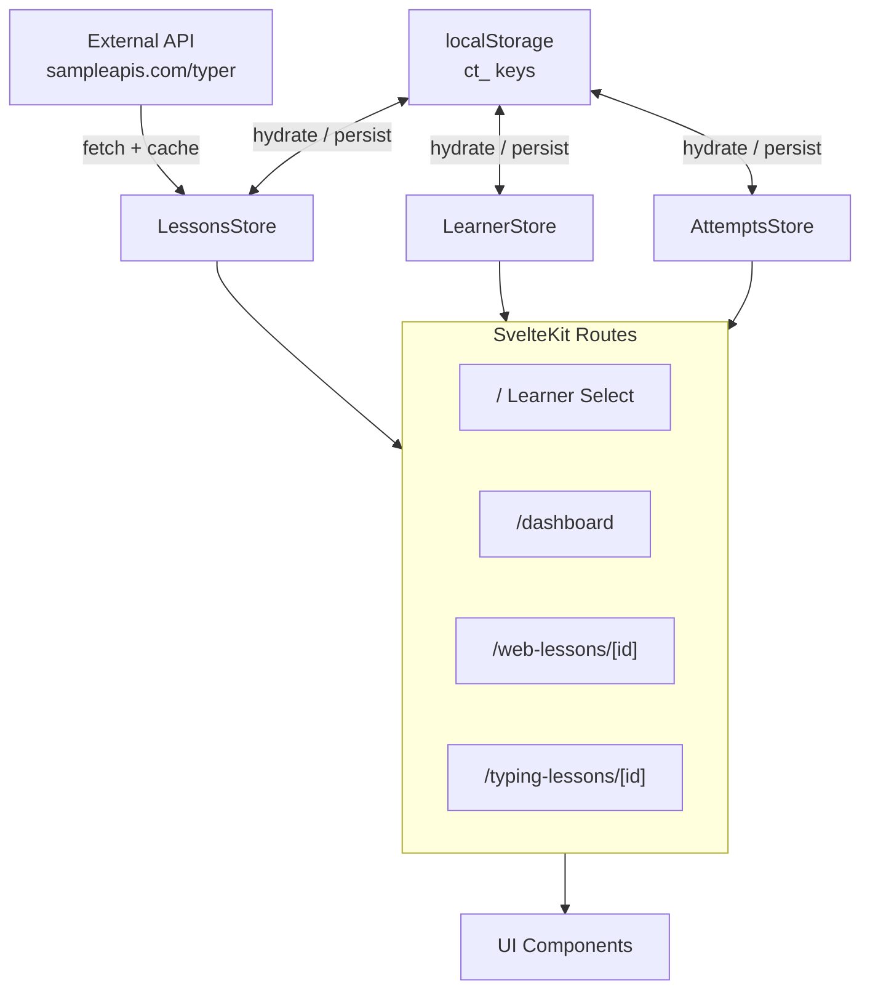

[Docs](../index.md)

# Architecture Overview

CosmicTyper is a SvelteKit 2 single-page application running entirely in the browser. There is no backend. Data lives in localStorage. Lessons are fetched from an external API and cached locally.

---

## System Map

---

## Key Layers

| Layer | What lives here |
|-------|----------------|
| **Routes** | Pages — each route owns its data-loading and layout |
| **Stores** | Reactive state — `learnerStore`, `lessonsStore`, `attemptsStore`, `codeDataStore` |
| **Components** | Reusable UI — `CodeGUI`, `TypingGUI`, `LearnerCard`, `ResultsScreen`, etc. |
| **Utils** | Pure helpers — `storage.ts`, `api.ts`, `format.ts`, `lesson.ts` |
| **Types** | Shared TypeScript interfaces — `Learner`, `Attempt`, `WebLesson`, `TypingLesson` |

---

## Technology Choices

- **SvelteKit 2 + Svelte 5 runes** — `$state`, `$derived`, `$effect` replace the old options API
- **TypeScript** throughout
- **Plain CSS** with custom properties — no CSS framework
- **Vite** dev server on port `7777`

---

## Further Reading

- [Routing](routing.md) — page structure and navigation flow
- [State Management](state-management.md) — how stores work and talk to each other
- [Data Persistence](data-persistence.md) — localStorage schema and key conventions
- [Component Structure](component-structure.md) — UI component hierarchy
