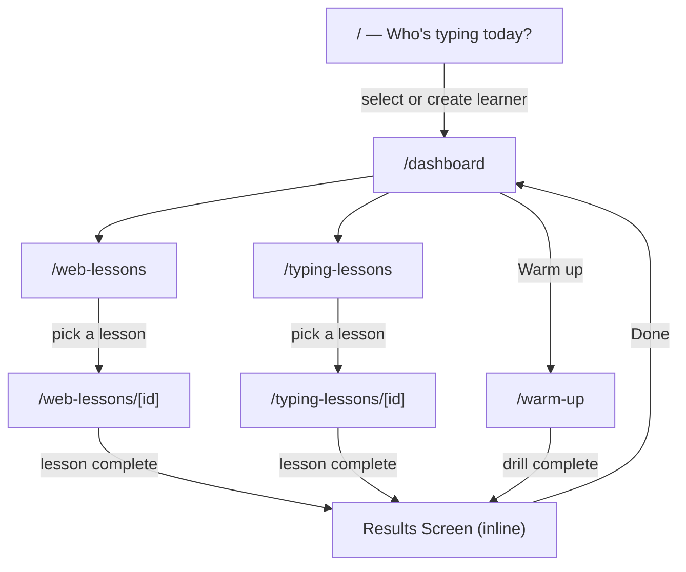

[Docs](../index.md) > [Architecture](index.md)

# Routing

CosmicTyper uses SvelteKit's file-based routing. Every page lives under `src/routes/`. The entry point is always the learner selection screen — there is no auto-login.

---

## Route Map

---

## Pages

| Route                  | File                                          | Purpose                                          |
| ---------------------- | --------------------------------------------- | ------------------------------------------------ |
| `/`                    | `src/routes/+page.svelte`                     | Learner select / create — always the entry point |
| `/dashboard`           | `src/routes/dashboard/+page.svelte`           | Personal dashboard for the active learner        |
| `/web-lessons`         | `src/routes/web-lessons/+page.svelte`         | Browse HTML/CSS lessons                          |
| `/web-lessons/[id]`    | `src/routes/web-lessons/[id]/+page.svelte`    | Active web lesson with live preview              |
| `/typing-lessons`      | `src/routes/typing-lessons/+page.svelte`      | Browse typing lessons                            |
| `/typing-lessons/[id]` | `src/routes/typing-lessons/[id]/+page.svelte` | Active typing lesson                             |
| `/warm-up`             | `src/routes/warm-up/+page.svelte`             | Personalized [warm-up drill](../behaviors/warm-up-drills.md), generated on entry |

### Admin & API

The [admin area](../behaviors/lesson-authoring.md) edits lesson files on disk; the API routes serve them to the learner app.

| Route                              | Purpose                                              |
| ---------------------------------- | ---------------------------------------------------- |
| `/admin`                           | Lesson list — create, open, delete lessons           |
| `/admin/web/[id]`, `/admin/typing/[id]` | Edit one web / typing lesson                    |
| `/admin/login`, `/admin/logout`    | Password login (sets session cookie) and logout      |
| `/api/lessons/web`, `/api/lessons/typing` | JSON endpoints reading `data/lessons/` on disk |

---

## Guards & Navigation Rules

- **Learner guard** — an effect in `src/routes/+layout.svelte` redirects to `/` when there is no active learner. Only `/` and `/admin/*` are exempt.
- **Admin guard** — `src/hooks.server.ts` checks the signed `ct_admin_session` cookie on every `/admin` request (except `/admin/login`) and redirects to the login page when it's missing or expired.
- The `[id]` segments use slugified lesson titles (lowercase, underscores), not database IDs.
- Lesson detail pages fetch the lesson list themselves on mount, so direct links and bookmarks work. An unknown slug shows a "Lesson not found" message with a link back to the list.
- The [results screen](../behaviors/results-and-progress.md) is not a route — it renders as a modal after a lesson completes, then navigates back to the dashboard.

---

## Further Reading

- [State Management](state-management.md) — how `learnerStore` holds the active learner across routes
- [Component Structure](component-structure.md) — what each route renders
- [User Journey](../behaviors/user-journey.md) — the user-facing flow across these routes
