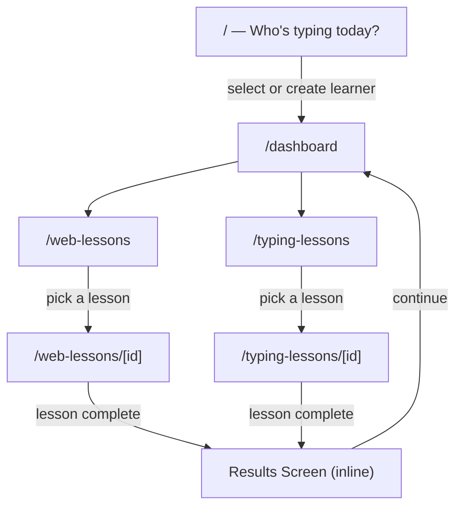

[Docs](../index.md) > [Architecture](index.md)

# Routing

CosmicTyper uses SvelteKit's file-based routing. Every page lives under `src/routes/`. The entry point is always the learner selection screen — there is no auto-login.

---

## Route Map

---

## Pages

| Route                  | File                                          | Purpose                                          |
| ---------------------- | --------------------------------------------- | ------------------------------------------------ |
| `/`                    | `src/routes/+page.svelte`                     | Learner select / create — always the entry point |
| `/dashboard`           | `src/routes/dashboard/+page.svelte`           | Personal dashboard for the active learner        |
| `/web-lessons`         | `src/routes/web-lessons/+page.svelte`         | Browse HTML/CSS lessons                          |
| `/web-lessons/[id]`    | `src/routes/web-lessons/[id]/+page.svelte`    | Active web lesson with live preview              |
| `/typing-lessons`      | `src/routes/typing-lessons/+page.svelte`      | Browse typing lessons                            |
| `/typing-lessons/[id]` | `src/routes/typing-lessons/[id]/+page.svelte` | Active typing lesson                             |

---

## Navigation Rules

- The [learner select screen](../behaviors/learner-system.md) (`/`) is always accessible — it's how you switch between learners.
- The dashboard is only meaningful with an active learner set in `learnerStore`.
- The `[id]` segments use slugified lesson titles, not database IDs.
- The [results screen](../behaviors/results-and-progress.md) is not a route — it renders inline after a lesson completes, then navigates back to the dashboard.

---

## Further Reading

- [State Management](state-management.md) — how `learnerStore` holds the active learner across routes
- [Component Structure](component-structure.md) — what each route renders
- [User Journey](../behaviors/user-journey.md) — the user-facing flow across these routes
