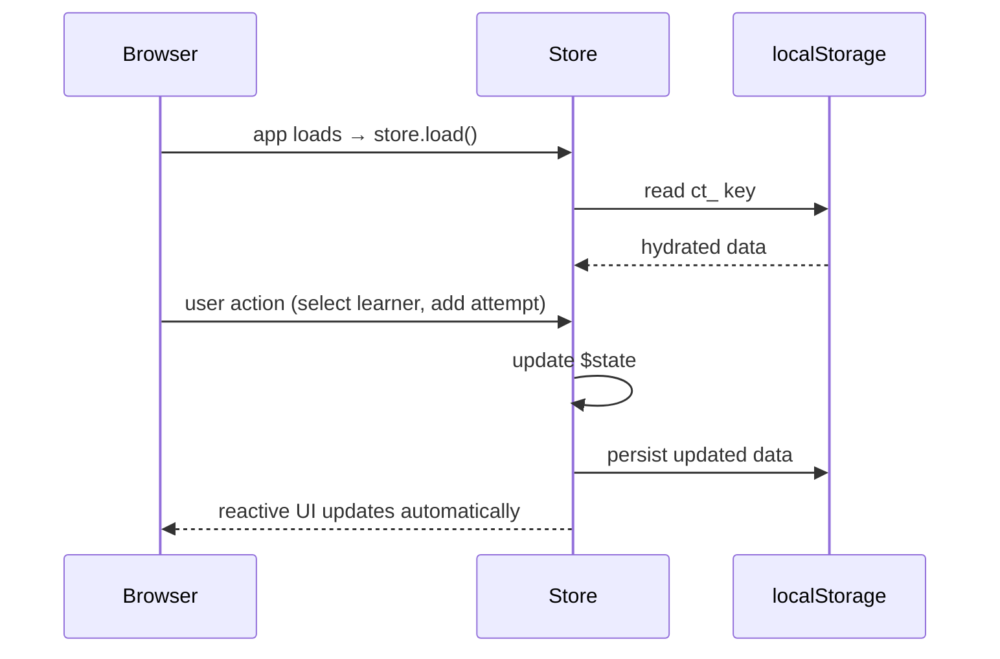

[Docs](../index.md) > [Architecture](index.md)

# State Management

CosmicTyper uses Svelte 5 runes. Each concern has its own store class using `$state`. There is no global state tree — stores are singletons imported where needed.

---

## Stores

| Store | File | Owns |
|-------|------|------|
| `learnerStore` | `src/lib/stores/learner.svelte.ts` | All learner profiles + the active learner |
| `lessonsStore` | `src/lib/stores/lessons.svelte.ts` | Web and typing lesson lists |
| `attemptsStore` | `src/lib/stores/attempts.svelte.ts` | Every lesson attempt ever made |
| `codeDataStore` | `src/lib/stores/codeData.svelte.ts` | In-progress code state during a web lesson |

---

## Data Flow

---

## Key Patterns

**Derived completion** — `hasCompleted` is never stored on a lesson object. It is derived per-learner at read time from `attemptsStore.completedLessonIds(learnerId)`. This means completion is always accurate to the current learner without data migration.

**Load once, cache** — `lessonsStore` checks localStorage before hitting the API. The legacy keys (`web-lessons`, `typing-lessons`) are deleted on load to force re-cache under the new `ct_` prefix.

**Active learner** — `learnerStore.activeLearner` is the single source of truth for who is logged in. It is set on learner selection and cleared on deactivation. No route guard exists — components check for `activeLearner` themselves.

---

## Further Reading

- [Data Persistence](data-persistence.md) — localStorage keys and schema
- [Routing](routing.md) — how the active learner flows across page navigation
- [Component Structure](component-structure.md) — how components subscribe to stores
