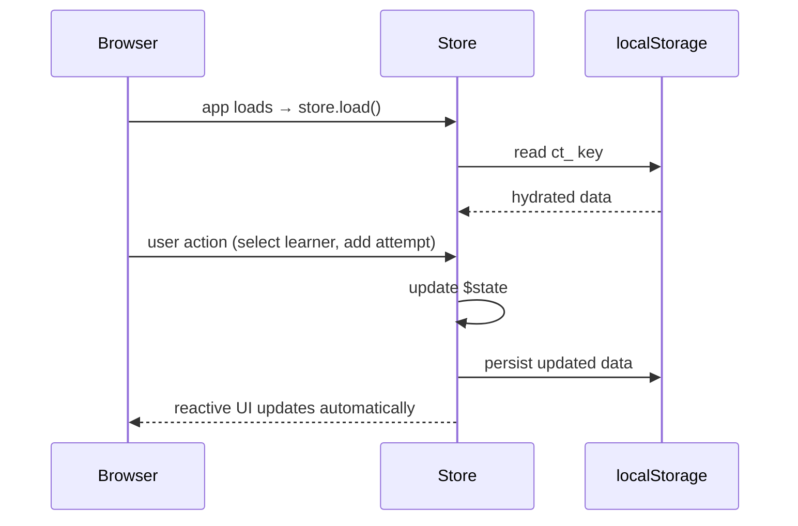

[Docs](../index.md) > [Architecture](index.md)

# State Management

CosmicTyper uses Svelte 5 runes. Each concern has its own store class using `$state`. There is no global state tree — stores are singletons imported where needed.

---

## Stores

| Store           | File                                | Owns                                                                                                                   |
| --------------- | ----------------------------------- | ---------------------------------------------------------------------------------------------------------------------- |
| `learnerStore`  | `src/lib/stores/learner.svelte.ts`  | All learner profiles + the active learner                                                                              |
| `lessonsStore`  | `src/lib/stores/lessons.svelte.ts`  | Web and typing lesson lists, fetched from `/api/lessons/*`                                                             |
| `attemptsStore` | `src/lib/stores/attempts.svelte.ts` | Every lesson attempt ever made, plus derived queries (`troubleKeys`, `completedLessonIds`, `latestFor`)                |
| `prefsStore`    | `src/lib/stores/prefs.svelte.ts`    | Per-learner UI preferences — currently just the keyboard-guide toggle (defaults on)                                    |
| `codeData`      | `src/lib/stores/codeData.svelte.ts` | In-progress code state during a web lesson (HTML lines, CSS lines, recently-rendered line indices for flash animation) |

---

## Data Flow

---

## Key Patterns

**Derived completion** — `hasCompleted` is never stored on a lesson object. It is derived per-learner at read time from `attemptsStore.completedLessonIds(learnerId)`. This means completion is always accurate to the current learner without data migration.

**Server-backed lessons** — `lessonsStore` fetches from `/api/lessons/*`, which reads `data/lessons/` on disk. Legacy lesson cache keys are deleted on load. Use `/admin` to edit lessons in the browser.

**Active learner** — `learnerStore.activeLearner` is the single source of truth for who is logged in. It is set on learner selection and cleared by the nav's **Switch** button. A client-side guard in `src/routes/+layout.svelte` redirects to `/` when a non-public route is visited with no active learner (`/` and `/admin/*` are exempt — admin has its own [cookie-based guard](routing.md)). See [Learner System](../behaviors/learner-system.md) for the product-level view.

**Validated hydration** — every store validates what it reads from localStorage: malformed attempts and learners are dropped, off-palette colors fall back to the first palette color, and corrupt JSON is discarded by the [storage helpers](data-persistence.md) so one bad key can't break app startup.

---

## Further Reading

- [Data Persistence](data-persistence.md) — localStorage keys and schema
- [Routing](routing.md) — how the active learner flows across page navigation
- [Component Structure](component-structure.md) — how components subscribe to stores
