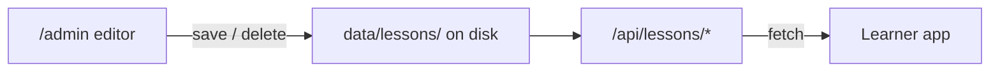

[Docs](../index.md) > [Behaviors](index.md)

# Lesson Authoring (Admin)

The `/admin` area is a password-protected editor for lesson content. It is for whoever runs the app — teachers, parents, developers — not for learners, so it has no link in the learner-facing nav and skips the learner guard entirely.

---

## Getting In

1. Visit `/admin` — you're redirected to `/admin/login`.
2. Enter the password from `ADMIN_PASSWORD` in `.env` (dev fallback: `cosmictyper-dev`; see `.env.example`).
3. A signed session cookie (`ct_admin_session`) keeps you logged in for 24 hours. `/admin/logout` ends the session.

Every `/admin` request is checked server-side in `src/hooks.server.ts` — there is no client-only gate to bypass.

---

## What You Can Do

- **Browse** all web and typing lessons, grouped by type with difficulty and step counts.
- **Create** a new lesson of either type — you're dropped straight into its editor.
- **Edit** a web lesson's steps (`WebStepEditor`) or a typing lesson's title, difficulty, and lines (`TypingLinesEditor`).
- **Delete** a lesson, which removes its files from disk.

Saving writes directly to `data/lessons/` — changes go live immediately because the learner app fetches lessons fresh from `/api/lessons/*`.

---

## Good to Know

- Lesson files are plain JSON and text — see [Data Persistence](../architecture/data-persistence.md) for the exact formats. Editing them directly works too.
- Renaming a lesson changes its URL slug in the learner app (slugs come from titles), so old links and the learner's completion history for that lesson break. Rename with care.

---

## Further Reading

- [Data Persistence](../architecture/data-persistence.md) — lesson file formats on disk
- [Routing](../architecture/routing.md) — admin routes and the cookie guard
- [Web Lessons](web-lessons.md) / [Typing Lessons](typing-lessons.md) — what the content you're editing drives
