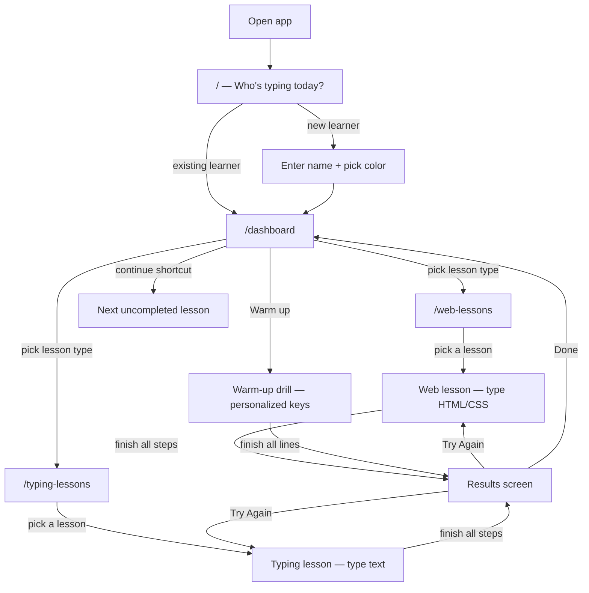

[Docs](../index.md) > [Behaviors](index.md)

# User Journey

Every session starts at the learner selection screen. There is no auto-login and no way to skip it. This is intentional — multiple people may share the same device.

---

## Full Flow

---

## Key Moments

**Learner selection** — the app shows all learner profiles as big cards. Search appears automatically once there are more than 6 learners. See [Learner System](learner-system.md).

**Dashboard** — personalised to the active learner. Shows stats, a "continue learning" shortcut to the next uncompleted lesson, a [warm-up card](warm-up-drills.md) targeting the keys they miss most, and quick links to both lesson types. See [Results and Progress](results-and-progress.md).

**Switching learners** — the **Switch** button in the nav clears the active learner and returns to `/`. Visiting any lesson page without an active learner also bounces back to `/`.

**During a lesson** — the learner types keystroke by keystroke. Wrong keys flash red but don't block progress. See [Web Lessons](web-lessons.md) and [Typing Lessons](typing-lessons.md).

**Results screen** — appears as a modal overlay the moment the last step is completed. Compares this run to the previous attempt. The learner can try again or return to the dashboard. See [Results and Progress](results-and-progress.md).

---

## Further Reading

- [Learner System](learner-system.md) — how profiles and selection work
- [Web Lessons](web-lessons.md) — what happens during a web lesson
- [Typing Lessons](typing-lessons.md) — what happens during a typing lesson
- [Results and Progress](results-and-progress.md) — what the results screen shows
