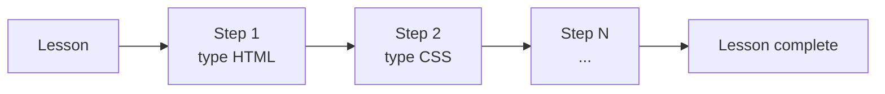

[Docs](../index.md) > [Behaviors](index.md)

# Web Lessons

A web lesson teaches HTML and CSS by having the learner type real code character by character. A live preview updates as they go, making the connection between what they type and what it looks like immediate.

---

## Lesson Structure

Each web lesson is a sequence of **steps**. Every step has:

- **`desc`** — a plain-English instruction shown to the learner (e.g. "Add a heading to the page")
- **`type`** — either `dom` (HTML) or `style` (CSS)
- **`action`** — the exact lines of code the learner must type
- **`render`** — whether completing this step updates the live preview

---

## Keystroke Mechanics

The learner types into the whole window — there is no text input field. Every keypress is captured globally.

1. Timer starts on the first keystroke.
2. The expected character is shown with a blinking underline cursor.
3. **Correct key** — the character lights up green and the cursor advances.
4. **Wrong key** — the cursor flashes red for 300ms, a mistake is counted, the cursor does not move. This is "show and forgive": the lesson never stops, but mistakes are recorded.
5. At the end of a line, the completed row is committed and the next line becomes active.
6. At the end of a step, the lesson advances to the next step automatically.

---

## Live Preview

When a step with `render: true` is completed:
- `dom` steps push their lines into the HTML output.
- `style` steps push their lines into the CSS output.

The preview pane re-renders on every committed row, so the learner sees the page build up in real time. Steps with `render: false` advance the code buffer without updating the visual output.

---

## Layout

The web lesson screen is split into two resizable panes:
- **Left** — the code editor (typed lines + step description + progress bar)
- **Right** — the live HTML/CSS preview

The divider is draggable so learners can adjust the split to their preference.

---

## Further Reading

- [Typing Lessons](typing-lessons.md) — the simpler single-pane typing experience
- [Results and Progress](results-and-progress.md) — what happens when the last step is complete
- [Component Structure](../architecture/component-structure.md) — `CodeGUI`, `Typer`, `HTMLOutput`, `ResizableSplit`
